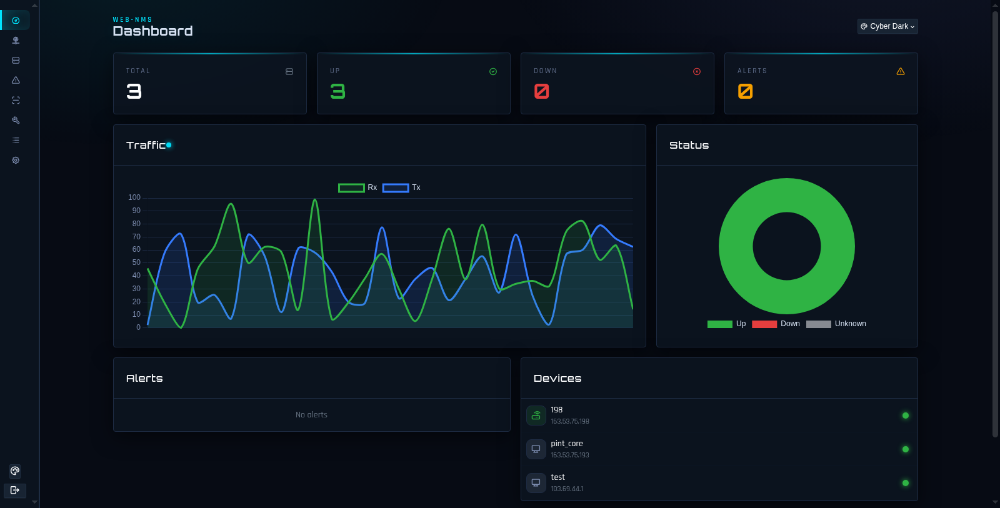
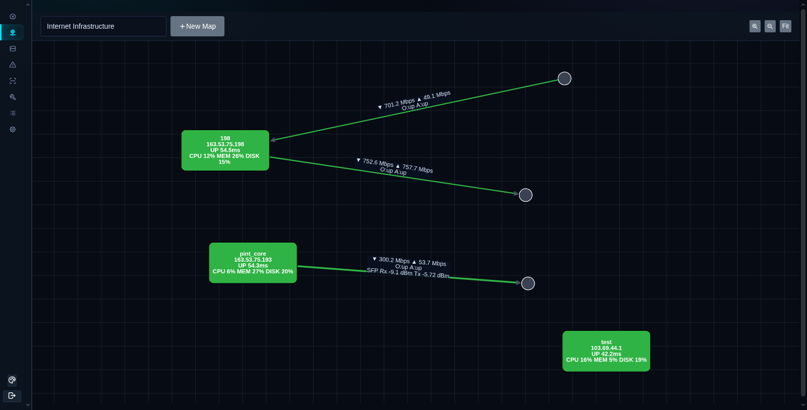
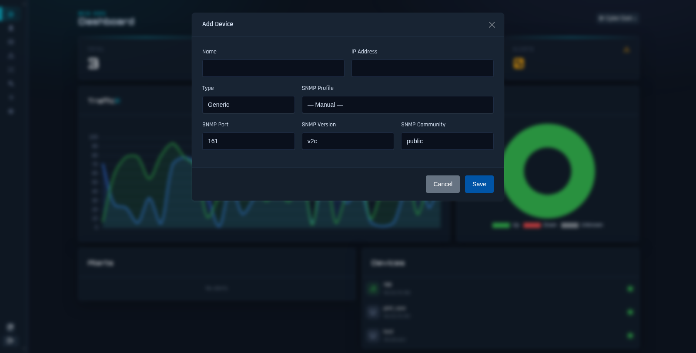
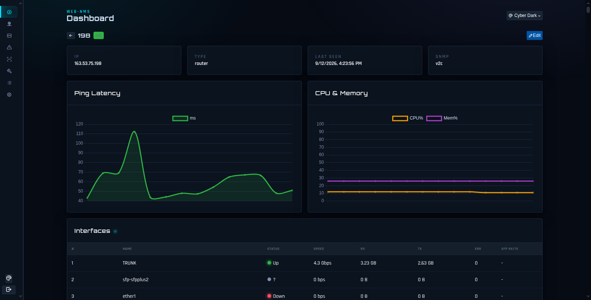
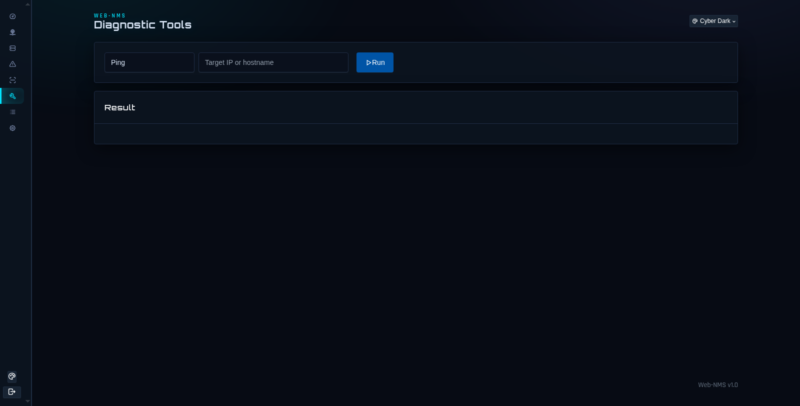

# visualNMS — Web-Based Network Management System

Real-time network monitoring with a live topology map, per-link traffic graphs,
SFP/fiber optical readings, device health tracking, and built-in diagnostic tools.
Node.js + Express + SQLite + Socket.IO on the backend, Cytoscape.js + Chart.js
on the frontend.



## Features

- **Live topology map** — drag-and-drop devices and static endpoints, device-to-device
  and device-to-internet links with real-time Rx/Tx rate labels, oper/admin status
  coloring, and hover graphs. Link width follows port speed (1px @10M → 7px @40G+).
- **Continuous link graphs** — per-cycle server-computed rates stored in
  `link_rate_history`; transient SNMP misses repeat the last good value (up to
  3 cycles) before drawing zero, so graphs stay continuous while a device is up.
- **SFP / fiber optical power** — Rx/Tx dBm, temperature, voltage and bias polled
  via ENTITY-SENSOR-MIB, CISCO-ENTITY-SENSOR-MIB and MikroTik `mtxrOpticalTable`,
  shown on edge labels, tooltips, context menus and interface tables.
- **Device health** — ping latency (hover mini-graph with current-value overlay),
  CPU / memory / disk, sysUpTime-based uptime, per-interface status and counters.
- **Link editing** — right-click a link to change either endpoint's interface and
  the interface speed, including **Auto (follow live SNMP speed)**.
- **Diagnostic Tools** — Ping, Traceroute, live-streaming **MTR** (cumulative
  loss/sent/last/avg/best/worst table), Port Scan (custom ports), DNS Lookup
  (A/AAAA/NS/MX/TXT/PTR), HTTP Check, SNMP Walk.
- **SNMP profiles** — reusable v1/v2c/v3 credential sets; device form shows
  manual Port/Version/Community fields only in Manual mode.
- **Discovery, alerts, event log, syslog/trap receivers, multi-theme UI.**



## Quick start

```bash
npm install
./start.sh            # or: PORT=3000 node server.js
# open http://localhost:3000
```

Default ports: **3000** (web), **1514/udp** (syslog), **10162/udp** (SNMP traps).
Data is stored in SQLite (`src/data/webnms.db`, auto-created with migrations).

## Manual

### 1. Add a device
Devices → **Add Device** (or map palette → add node). Fill Name, IP, Type, then
either pick an **SNMP Profile** or use **Manual** and enter Port / Version /
Community (v3 expands user/auth/privacy rows).



### 2. Build a map
Topology → **New Map**, drag devices (and static endpoints such as "internet"
clouds) from the palette, drag to position. Click the link tool, pick a source
interface, then a target interface to create a link.

### 3. Read the map
- Edge labels show `▼ Rx ▲ Tx`, oper/admin state, and `SFP Rx/Tx dBm` on fiber.
- Hover a link for the live traffic graph; hover a device for the latency
  mini-graph, uptime, CPU/memory/disk.
- Right-click a link → **Edit** (interfaces, speed incl. Auto) or **Delete**.
- Right-click a device → Refresh, Edit, Ping, SNMP poller, Port Scanner, Traceroute.

### 4. Device page
Click a node (or Devices → view) for ping latency and CPU/memory charts plus the
full interface table with live status, counters and SFP columns.



### 5. Diagnostic Tools
Tools page → pick a tool, enter target, **Run**. MTR streams live until **Stop**.



### 6. SNMP profiles & polling
Settings → SNMP Profiles to manage credential sets. Polling tiers:
**ping 5s → light SNMP 2s** (CPU/mem/disk + map-bound interfaces) →
**full walk hourly** (all interfaces, DOM discovery). Dead devices back off and
re-probe periodically. Health counters at `GET /api/poller/stats`.

## Architecture

```
server.js → Express API (src/api/routes.js) + Socket.IO (src/websocket/)
src/pollers/  ping.js · snmp.js (walks, DOM, MikroTik optical)
              link-stats.js (rate math, carry-forward, enrichLink)
              poller-engine.js (ping/light/full cycles, loop stats)
src/database/ db.js (SQLite + migrations)    src/tools/ traceroute.js (mtr/scan)
public/js/app.js (Cytoscape map, charts, tooltips, tools UI)
```

Realtime socket events: `poll:results`, `poll:snmp`, `link:stats`,
`link:history`, `tool:mtr-data`, `map:updated`, `alert:new`.

## Troubleshooting

| Symptom | Cause / fix |
|---|---|
| Blank page | Hard-reload (Ctrl+Shift+R) — the JS bundle is cache-busted on each release |
| Link shows no interface | Bind one via right-click → Edit, or recreate with the interface picker |
| SFP shows nothing on 198-class links | Module exposes no DDM over SNMP (verified empty optical table) — needs a DDM-capable SFP |
| Graph gaps while device up | Check `/api/poller/stats` for light-cycle skips; raise SNMP timeout or reduce per-cycle OIDs |
| SNMP walk tool returns few interfaces | Slow-link walk timeouts are transient — retry |
